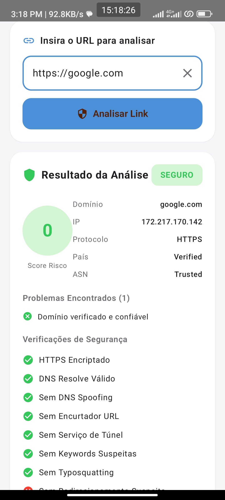
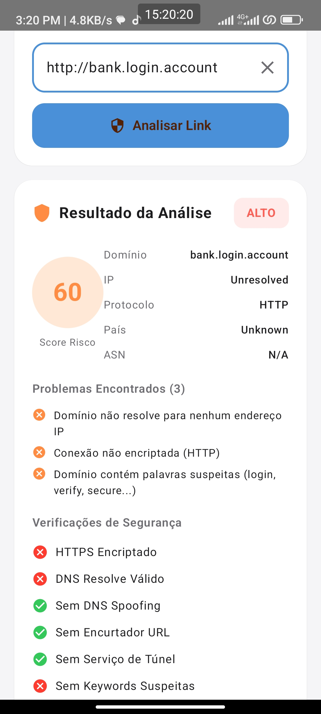
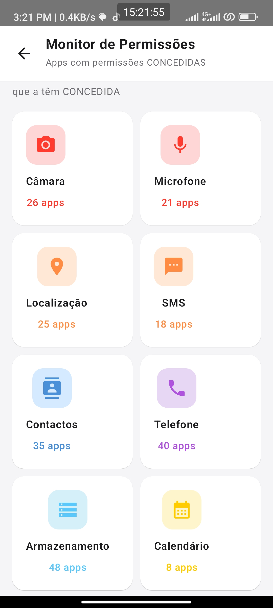
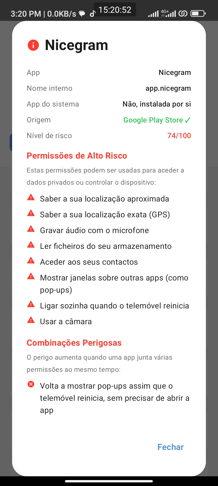
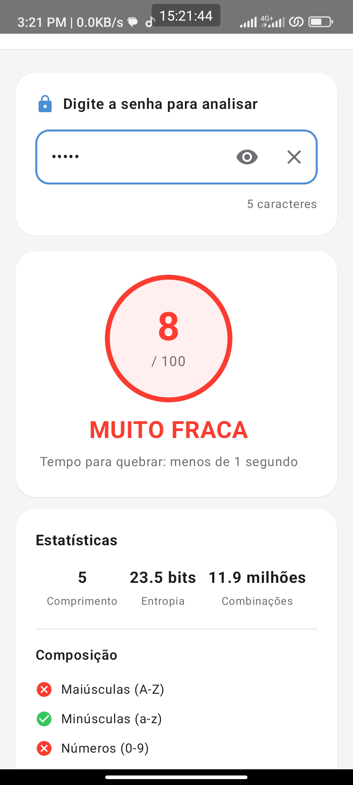

# Privacity

**Privacity** is an Android application focused on **digital security and privacy**, designed to help users **identify risks, inspect suspicious links, monitor sensitive permissions, review installed applications, analyze Wi-Fi exposure, and observe network activity** from a single mobile interface.

The project was built with a strong emphasis on **user protection**, **privacy awareness**, **preventive monitoring**, and **clarity of information**, combining multiple security-oriented tools into one modern Android experience powered by **Kotlin** and **Jetpack Compose**.

---

## Visão Geral

O **Privacity** foi criado para oferecer ao utilizador uma visão mais clara sobre a segurança e a privacidade do próprio dispositivo Android. Em vez de funcionar como uma ferramenta isolada, o aplicativo centraliza diferentes recursos de análise e monitorização para ajudar o utilizador a compreender melhor:

* quais aplicações possuem permissões potencialmente invasivas;
* quais links podem representar risco de phishing ou comportamento suspeito;
* como está o contexto de segurança da rede Wi-Fi utilizada;
* como o consumo de rede se distribui entre aplicações e períodos;
* quais sinais gerais podem indicar um ambiente menos seguro no dispositivo.

O resultado é uma aplicação voltada para **privacidade, prevenção e consciencialização**, combinando análise local, estatísticas, observação de permissões e indicadores de segurança numa interface moderna e acessível.

---

## Objetivo do Projeto

O objetivo do **Privacity** é reunir, numa única aplicação Android, funcionalidades úteis de **segurança e privacidade** que normalmente aparecem dispersas em diferentes apps ou ficam escondidas em áreas técnicas do sistema.

Este projeto foi desenvolvido para:

* aumentar a visibilidade do utilizador sobre o próprio dispositivo;
* facilitar a identificação de permissões sensíveis e aplicações potencialmente suspeitas;
* ajudar na deteção preventiva de links maliciosos ou enganosos;
* fornecer contexto sobre redes Wi-Fi e utilização de rede;
* traduzir sinais técnicos de risco em informações mais compreensíveis;
* servir como projeto de portfólio com foco em **Android moderno + segurança aplicada ao utilizador**.

---

## Funcionalidades Principais

## 1. Analisador de Links

O Privacity inclui um módulo de análise de links pensado para reduzir a exposição do utilizador a **URLs maliciosas, phishing, redirecionamentos suspeitos e domínios duvidosos**.

### O que pode ser analisado

* padrões associados a phishing;
* links encurtados ou mascarados;
* domínios com aparência suspeita;
* estruturas de redirecionamento;
* sinais relacionados com túneis, CDNs ou infraestruturas potencialmente usadas para mascarar origem;
* indicadores que possam sugerir tentativa de fraude, recolha indevida de dados ou engenharia social.

### Valor para o utilizador

Oferece uma camada inicial de triagem antes de confiar ou abrir um link recebido por mensagem, e-mail, redes sociais ou outras aplicações.

---

## 2. Detector de Aplicações Suspeitas

O projeto inclui uma área dedicada à inspeção de aplicações instaladas, com foco em **identificar apps que merecem revisão do ponto de vista de privacidade e segurança**.

### O que este módulo procura destacar

* aplicações com permissões excessivas para a sua finalidade;
* pedidos de acesso a recursos sensíveis;
* combinações de permissões potencialmente invasivas;
* apps que mereçam atenção adicional por parte do utilizador;
* sinais que possam indicar um perfil de risco mais elevado.

### Valor para o utilizador

Ajuda a perceber **quais apps podem representar maior risco de privacidade** e apoia decisões de desinstalação, revisão de permissões ou monitorização.

---

## 3. Monitorização de Permissões

A monitorização de permissões é um dos pilares do Privacity. O objetivo é permitir que o utilizador entenda **o que cada aplicação pode aceder dentro do dispositivo**.

### O que esta funcionalidade oferece

* visualização das permissões concedidas por aplicação;
* destaque para permissões consideradas sensíveis;
* apoio à auditoria manual de apps instaladas;
* melhor compreensão do nível de acesso concedido a cada app;
* base para alertas, avaliação de risco e score de segurança.

### Exemplos de permissões relevantes

* câmara;
* microfone;
* localização;
* contactos;
* SMS;
* armazenamento;
* acesso à rede;
* notificações;
* outros recursos sensíveis do sistema.

### Valor para o utilizador

Permite maior controlo sobre a superfície de exposição do dispositivo e incentiva uma gestão mais consciente das permissões concedidas.

---

## 4. Análise de Redes Wi-Fi

O módulo de Wi-Fi foi pensado para oferecer uma visão mais clara do ambiente de rede utilizado pelo utilizador, com foco em **segurança básica, exposição e contexto de risco**.

### O que pode ser observado

* redes abertas ou sem proteção adequada;
* redes próximas detetadas pelo dispositivo;
* contexto de utilização de redes públicas;
* indicadores úteis para alertar o utilizador sobre ambientes menos confiáveis;
* sinais que reforcem a necessidade de atenção ao usar determinadas redes.

### Valor para o utilizador

Ajuda a reduzir a exposição ao uso despreocupado de redes Wi-Fi abertas ou inseguras e reforça a consciencialização sobre segurança de rede.

---

## 5. Estatísticas e Uso de Rede

O Privacity também apresenta informações relacionadas com o consumo de rede, ajudando o utilizador a observar melhor a atividade do dispositivo.

### O que pode ser acompanhado

* consumo de dados por período;
* visão geral da utilização de rede;
* aplicações com maior atividade;
* padrões que possam justificar atenção;
* contexto adicional para análise de segurança e privacidade.

### Valor para o utilizador

Fornece uma camada extra de observação sobre o tráfego do dispositivo, ajudando a perceber **quais apps estão a comunicar mais** e quando esse comportamento merece revisão.

---

## 6. Verificador de Senhas

O projeto inclui uma funcionalidade voltada para avaliação da robustez de palavras-passe.

### Critérios possíveis de avaliação

* comprimento;
* variedade de caracteres;
* previsibilidade;
* padrões fracos;
* robustez estimada.

### Valor para o utilizador

Promove boas práticas de segurança e ajuda na criação ou validação de senhas mais fortes.

---

## 7. Centro de Alertas

O Privacity centraliza avisos e sinais relevantes para a segurança do utilizador, transformando eventos técnicos em alertas mais acessíveis.

### Exemplos de alertas

* ligação a redes Wi-Fi públicas;
* deteção de links suspeitos;
* apps recém-instaladas com permissões sensíveis;
* mudanças no contexto de segurança do dispositivo;
* recomendações de revisão manual.

### Valor para o utilizador

Aproxima segurança e usabilidade, fornecendo feedback mais direto sobre eventos que podem merecer atenção.

---

## 8. Score de Segurança

O **Score de Segurança** funciona como um resumo do estado geral do dispositivo, agregando sinais de risco e contexto de utilização.

### Fatores que podem influenciar o score

* permissões sensíveis concedidas;
* presença de aplicações com perfil suspeito;
* contexto de redes Wi-Fi menos seguras;
* indicadores de links de risco;
* outros elementos usados pelo sistema para compor a perceção de segurança.

### Valor para o utilizador

Oferece uma leitura rápida do estado de segurança do dispositivo e serve como indicador geral de atenção.

---

## Destaques do Projeto

O **Privacity** foi pensado como um projeto com valor prático e técnico, reunindo num único aplicativo:

* análise de links suspeitos;
* auditoria de permissões de aplicações;
* monitorização de uso de rede;
* observação de redes Wi-Fi;
* alertas de segurança;
* score agregado de risco;
* interface moderna com Jetpack Compose;
* foco em proteção do utilizador e privacidade digital.

---

## Tecnologias Utilizadas

O projeto foi desenvolvido com tecnologias modernas do ecossistema Android:

* **Kotlin**
* **Jetpack Compose**
* **Material Design 3**
* **Android SDK**
* arquitetura organizada por ecrãs e funcionalidades
* UI declarativa
* foco em usabilidade, legibilidade e escalabilidade

---

## Informações Técnicas

| Item                    | Detalhes                 |
| ----------------------- | ------------------------ |
| **Nome do projeto**     | Privacity                |
| **Plataforma**          | Android                  |
| **Linguagem principal** | Kotlin                   |
| **UI Toolkit**          | Jetpack Compose          |
| **Design System**       | Material Design 3        |
| **Package**             | `com.edissone.privacity` |
| **Versão**              | `1.0.0`                  |
| **SDK alvo**            | Android SDK 36           |
| **SDK mínimo**          | Android SDK 26           |
| **Licença**             | MIT                      |

---

## Experiência do Utilizador

A experiência do utilizador no Privacity foi pensada para ser **simples, visual e informativa**. A aplicação procura traduzir conceitos técnicos de segurança para uma linguagem mais acessível através de:

* cartões informativos;
* indicadores visuais de risco;
* listas de permissões e aplicações;
* painéis de estatísticas;
* alertas e recomendações;
* ecrãs dedicados para análise e monitorização.

A ideia central é que o utilizador **não precise de ser especialista em cibersegurança** para perceber quando algo merece atenção.

---

## Casos de Uso

O Privacity pode ser útil em cenários como:

* verificar rapidamente se um link recebido pode ser perigoso;
* descobrir quais apps têm acesso a recursos sensíveis do dispositivo;
* rever permissões excessivas concedidas sem perceber;
* observar o consumo de rede de aplicações instaladas;
* evitar o uso despreocupado de redes Wi-Fi abertas;
* ter uma noção geral do estado de segurança do smartphone;
* adotar uma postura mais consciente em relação à privacidade digital.

---

## Capturas de Ecrã

<p align="center">
  
  
</p>

<p align="center">
  
  
  
</p>

<p align="center">
  
  
</p>

## Valor para Portfólio

O Privacity é um projeto relevante para portfólio porque demonstra competências em múltiplas áreas ao mesmo tempo:

### Desenvolvimento Android

* construção de aplicação real com múltiplos ecrãs e funcionalidades;
* uso de **Kotlin + Jetpack Compose**;
* organização de interface moderna e reutilizável;
* preocupação com usabilidade e design de produto.

### Produto e Experiência

* definição clara de proposta de valor;
* foco em resolver problemas reais de utilizadores;
* centralização de métricas e indicadores de segurança;
* equilíbrio entre utilidade prática e apresentação visual.

### Segurança Aplicada ao Utilizador

* análise de links;
* monitorização de permissões;
* observação de apps suspeitas;
* atenção ao contexto de rede e Wi-Fi;
* comunicação de risco de forma compreensível.

---

## Evoluções Futuras

O Privacity foi pensado como uma base forte para evoluções futuras. Algumas melhorias possíveis incluem:

* integração com serviços externos de reputação de URLs;
* motor de classificação de risco mais avançado;
* histórico de análises e eventos de segurança;
* dashboard com insights por período;
* exportação de relatórios de segurança;
* recomendações automáticas com maior contexto;
* persistência local com Room;
* arquitetura mais modular;
* testes unitários e instrumentados;
* suporte multilíngue;
* melhorias de acessibilidade e performance.

---

## Instalação e Execução

### Requisitos

* Android Studio atualizado
* JDK compatível com o projeto
* Android SDK configurado
* dispositivo físico ou emulador Android

### Passos

```bash id="ajtl9n"
git clone https://github.com/DevCode22/privacity.git
cd privacity
```

Depois:

1. abre o projeto no Android Studio;
2. sincroniza as dependências Gradle;
3. executa a aplicação num emulador ou dispositivo físico.

---

## Estado do Projeto

O Privacity encontra-se como um projeto funcional e em evolução, com foco em consolidar uma experiência de segurança e privacidade cada vez mais útil para o utilizador final.

Atualmente, o projeto já demonstra uma base sólida em:

* interface moderna;
* proposta clara de produto;
* funcionalidades orientadas à segurança;
* monitorização de permissões, links, rede e contexto de risco;
* foco prático em privacidade digital no Android.

---

## Licença

Este projeto está licenciado sob a **MIT License**.

---

## Autor

**DevCode**
Desenvolvedor Android com foco em **aplicações mobile, privacidade, segurança digital e experiência do utilizador**.

